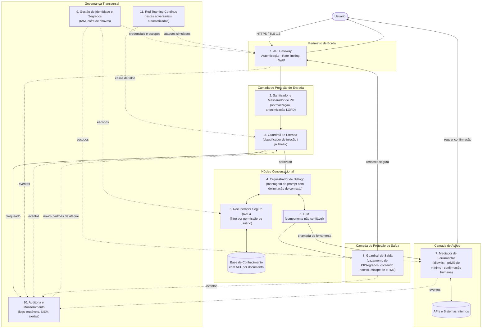

# Proposta de Melhoria do Requisito Não Funcional de Segurança em um Sistema Conversacional

**Alternativa escolhida:** (Alternativa 2) Considerando aspectos de segurança, propor como melhorar este requisito não funcional no sistema conversacional.

**Autor:** Felipe Simão

---

## Sumário

1. [Introdução](#1-introdução)
2. [Solução Proposta](#2-solução-proposta)
3. [Conclusão](#3-conclusão)
4. [Referências Bibliográficas](#4-referências-bibliográficas)

---

## 1. Introdução

### 1.1 Contexto

Sistemas conversacionais — chatbots e assistentes virtuais — deixaram de ser simples árvores de decisão com respostas pré-programadas e passaram a ser construídos sobre Modelos de Linguagem de Grande Escala (*Large Language Models*, LLMs), frequentemente integrados a bases de conhecimento (RAG — *Retrieval-Augmented Generation*), APIs internas e ferramentas capazes de executar ações em nome do usuário. Essa evolução amplia o valor entregue, mas também amplia significativamente a **superfície de ataque** do sistema.

Na engenharia de software, segurança é classificada como um **requisito não funcional**: não descreve *o que* o sistema faz, mas *com que qualidade* ele o faz. O modelo de qualidade de produto da ISO/IEC 25010 define segurança como o grau em que um produto protege informações e dados, de modo que pessoas ou outros sistemas tenham acesso apenas na medida adequada aos seus níveis de autorização, decompondo-a em confidencialidade, integridade, não repúdio, responsabilização (*accountability*) e autenticidade (ISO/IEC, 2023). Sommerville (2018) ressalta que requisitos não funcionais costumam ser mais críticos que os funcionais, pois sua falha pode tornar todo o sistema inutilizável.

### 1.2 Descrição do problema

Em um sistema conversacional, a principal entrada do sistema é **texto livre em linguagem natural**, vindo de um usuário não necessariamente confiável. Diferentemente de um formulário com campos validados, não há um esquema rígido que permita separar "dado" de "instrução". Disso decorrem ameaças específicas, catalogadas pelo OWASP Top 10 para Aplicações com LLM (OWASP, 2025):

| Ameaça | Descrição | Impacto no sistema conversacional |
|---|---|---|
| **Injeção de prompt (direta)** | O usuário escreve instruções que tentam sobrescrever as regras do sistema ("ignore as instruções anteriores…"). | Quebra de política, vazamento do *system prompt*, respostas indevidas (PEREZ; RIBEIRO, 2022). |
| **Injeção de prompt (indireta)** | Instruções maliciosas escondidas em documentos, páginas web ou e-mails que o bot lê via RAG ou ferramentas. | O bot executa ações que o usuário nunca pediu (GRESHAKE *et al.*, 2023). |
| **Divulgação de informação sensível** | O modelo revela dados pessoais, segredos ou dados de outros usuários presentes no contexto ou no treinamento. | Violação da LGPD e da confidencialidade (CARLINI *et al.*, 2021). |
| **Agência excessiva** | O bot possui permissões amplas demais em ferramentas e APIs. | Uma única injeção bem-sucedida resulta em ações destrutivas. |
| **Tratamento inseguro da saída** | A resposta do modelo é renderizada ou executada sem validação (HTML, SQL, comandos). | XSS, injeção de SQL, execução remota de código. |
| **Consumo ilimitado** | Requisições massivas ou prompts muito longos. | Negação de serviço e custo financeiro descontrolado. |

### 1.3 Justificativa

A melhoria do requisito de segurança se justifica por quatro razões principais:

1. **Obrigação legal:** a Lei Geral de Proteção de Dados (BRASIL, 2018) exige, em seu art. 46, que os agentes de tratamento adotem medidas de segurança técnicas e administrativas aptas a proteger os dados pessoais. Conversas com chatbots frequentemente contêm nome, CPF, endereço e dados de saúde ou financeiros.
2. **Natureza probabilística do LLM:** não é possível "provar" que um modelo nunca obedecerá a uma instrução maliciosa. Portanto, a segurança não pode depender apenas do modelo; ela precisa ser garantida por **camadas determinísticas ao redor dele** — o princípio de *defesa em profundidade*.
3. **Confiança do usuário:** riscos como vazamento de dados e geração de conteúdo nocivo afetam diretamente a confiança e a adoção do sistema (WEIDINGER *et al.*, 2021).
4. **Alinhamento a frameworks reconhecidos:** o NIST AI Risk Management Framework (NIST, 2023) recomenda que riscos de IA sejam governados, mapeados, medidos e gerenciados continuamente — o que exige uma arquitetura que produza evidências (logs, métricas, testes).

Assim, o problema abordado neste trabalho é: **como estruturar a arquitetura de um sistema conversacional de modo que a segurança seja garantida por mecanismos verificáveis, independentes do comportamento do modelo de linguagem?**

---

## 2. Solução Proposta

### 2.1 Visão geral

A proposta é uma **arquitetura de defesa em profundidade baseada em Confiança Zero (*Zero Trust*)** (ROSE *et al.*, 2020), na qual nenhuma entrada — seja do usuário, de um documento recuperado ou da própria saída do LLM — é considerada confiável por padrão. O LLM é tratado como um componente **não confiável**, isolado entre dois perímetros de verificação (entrada e saída), e todas as ações com efeitos colaterais passam por um mediador de ferramentas com privilégio mínimo.

Os princípios que guiam a solução são:

- **Defesa em profundidade:** várias camadas independentes; a falha de uma não compromete o sistema.
- **Privilégio mínimo:** o bot só acessa os dados e as ferramentas estritamente necessários para o usuário autenticado.
- **Separação entre dados e instruções:** conteúdo externo é marcado e tratado como dado, nunca como comando.
- **Humano no circuito (*human-in-the-loop*):** ações irreversíveis exigem confirmação explícita.
- **Observabilidade e melhoria contínua:** tudo é auditado, medido e testado adversarialmente de forma recorrente.

### 2.2 Diagrama de arquitetura

### 2.3 Fluxo de uma mensagem

1. O usuário envia a mensagem pelo canal (web, app, WhatsApp), sempre via TLS.
2. O **API Gateway** autentica o usuário, aplica limites de taxa e descarta requisições malformadas.
3. O **Sanitizador** normaliza o texto (remove caracteres invisíveis e Unicode ofuscado) e mascara dados pessoais que não são necessários para a tarefa.
4. O **Guardrail de Entrada** classifica a mensagem; se identificar tentativa de injeção ou conteúdo proibido, bloqueia e registra o evento.
5. O **Orquestrador** monta o prompt, separando com delimitadores explícitos as instruções do sistema, o histórico, os documentos recuperados (marcados como "dados não confiáveis") e a pergunta do usuário.
6. O **Recuperador Seguro** busca apenas documentos que o usuário autenticado tem permissão de ler.
7. O **LLM** gera a resposta ou solicita o uso de uma ferramenta.
8. Se houver chamada de ferramenta, o **Mediador** valida os parâmetros contra um esquema, verifica o escopo do usuário e, caso a ação seja sensível (transferência, exclusão, envio), pede confirmação explícita.
9. O **Guardrail de Saída** verifica vazamento de dados, segredos e conteúdo nocivo, e escapa a saída antes de renderizá-la.
10. Todos os eventos são enviados para **Auditoria**, que alimenta o ciclo de melhoria contínua.

### 2.4 Responsabilidades de cada módulo

| # | Módulo | Responsabilidades | Ameaças mitigadas | Tecnologias de referência |
|---|---|---|---|---|
| 1 | **API Gateway** | Ponto único de entrada; terminação TLS; autenticação (OAuth 2.0 / OIDC); *rate limiting* por usuário e por IP; limite de tamanho de mensagem; WAF contra ataques web clássicos. | Consumo ilimitado, DoS, acesso não autenticado. | Kong, AWS API Gateway, Cloudflare. |
| 2 | **Sanitizador e Mascarador de PII** | Normalizar Unicode e remover caracteres de controle ou invisíveis usados para ofuscar ataques; detectar e mascarar dados pessoais (CPF, cartão, telefone) antes de enviá-los ao LLM, em atendimento ao princípio da necessidade da LGPD. | Divulgação de informação sensível, ofuscação de injeções. | Microsoft Presidio, expressões regulares, NER. |
| 3 | **Guardrail de Entrada** | Classificar a intenção da mensagem (legítima, injeção, *jailbreak*, conteúdo proibido) com um modelo especializado; aplicar política de bloqueio ou de resposta segura; registrar tentativas. | Injeção de prompt direta, *jailbreak*. | Llama Guard (INAN *et al.*, 2023), NeMo Guardrails, classificadores próprios. |
| 4 | **Orquestrador de Diálogo** | Gerenciar o estado da conversa; montar o prompt com separação estrutural entre instruções e dados (*spotlighting*/delimitadores); nunca incluir segredos no prompt; limitar o tamanho do histórico; aplicar o *system prompt* versionado. | Injeção indireta, vazamento do *system prompt*. | LangChain, LangGraph, código próprio. |
| 5 | **LLM** | Gerar linguagem natural e decidir chamadas de ferramenta. É tratado como **não confiável**: não possui credenciais, não acessa a rede diretamente e não tem memória entre usuários. | — (é o componente protegido pelas demais camadas). | Modelo hospedado ou *self-hosted*. |
| 6 | **Recuperador Seguro (RAG)** | Buscar documentos relevantes aplicando **controle de acesso por documento** de acordo com a identidade do usuário; marcar o conteúdo recuperado como dado externo; verificar a origem dos documentos na ingestão para evitar envenenamento da base. | Vazamento entre usuários, envenenamento de dados, injeção indireta. | Bancos vetoriais com filtro de metadados (pgvector, Weaviate). |
| 7 | **Mediador de Ferramentas** | Expor ao LLM apenas uma *allowlist* de ferramentas; validar argumentos com esquema (JSON Schema); executar com o token **do usuário** e não com um superusuário; exigir confirmação humana para ações irreversíveis; executar código em *sandbox*. | Agência excessiva, escalonamento de privilégios. | Function calling com validação, OPA (*Open Policy Agent*). |
| 8 | **Guardrail de Saída** | Detectar PII, segredos (chaves de API, tokens) e conteúdo nocivo na resposta; escapar HTML e Markdown antes da renderização; verificar se a resposta não contém o *system prompt*; aplicar política de recusa. | Tratamento inseguro da saída (XSS), divulgação de informação sensível. | Llama Guard, Presidio, detectores de segredos. |
| 9 | **Gestão de Identidade e Segredos** | Emitir e validar identidades; definir escopos (RBAC/ABAC) consumidos pelo RAG e pelo Mediador; armazenar chaves de API em cofre com rotação automática; garantir criptografia em repouso (AES-256). | Roubo de credenciais, acesso indevido. | Keycloak, HashiCorp Vault, AWS KMS. |
| 10 | **Auditoria e Monitoramento** | Registrar de forma imutável requisições, bloqueios, chamadas de ferramenta e respostas (com PII mascarada); gerar alertas para padrões anômalos; apoiar respostas a incidentes e a obrigação de comunicação à ANPD (art. 48 da LGPD); aplicar política de retenção e eliminação de dados. | Não repúdio, responsabilização, detecção tardia. | ELK Stack, Grafana, SIEM. |
| 11 | **Red Teaming Contínuo** | Executar periodicamente (e a cada nova versão do prompt ou do modelo) uma bateria automatizada de ataques conhecidos; medir a taxa de sucesso dos ataques; transformar falhas em novos casos de teste e em dados de treino para o Guardrail de Entrada. | Regressões de segurança, novas técnicas de ataque. | Garak, PyRIT, MITRE ATLAS como catálogo de técnicas. |

### 2.5 Métricas para verificar o requisito

Para que o requisito não funcional seja **mensurável** — e não apenas uma intenção — propõem-se os seguintes indicadores:

| Métrica | Meta sugerida |
|---|---|
| Taxa de sucesso de ataques na suíte de *red teaming* | < 2% |
| Taxa de falsos positivos do Guardrail de Entrada (mensagens legítimas bloqueadas) | < 1% |
| Ocorrências de PII não mascarada nos logs | 0 |
| Ações sensíveis executadas sem confirmação humana | 0 |
| Latência adicional introduzida pelas camadas de segurança (p95) | < 300 ms |
| Tempo médio para detecção de incidente (MTTD) | < 15 min |

---

## 3. Conclusão

A principal lição deste trabalho é que, em sistemas conversacionais baseados em LLM, **a segurança não pode ser delegada ao modelo**. Por mais bem escrito que seja o *system prompt*, o LLM continua sendo um componente probabilístico que pode ser persuadido. Por isso, a proposta desloca a responsabilidade pela segurança para camadas determinísticas e auditáveis ao redor dele: autenticação na borda, filtros de entrada e saída, controle de acesso no RAG e, sobretudo, um mediador de ferramentas que impede que uma injeção bem-sucedida se transforme em um dano real. Na minha visão, o **Mediador de Ferramentas** e o **controle de acesso no RAG** são as peças de maior retorno, porque reduzem o impacto de qualquer falha nas demais camadas — um ataque que "engana" o modelo, mas não consegue acessar nada além do que o próprio usuário já poderia acessar, tem impacto muito limitado.

Considero a proposta viável, mas ela envolve trocas que precisam ser consideradas:

- **Latência e custo:** cada guardrail baseado em modelo adiciona uma inferência extra. Uma estratégia é usar primeiro filtros baratos (regras e expressões regulares) e acionar classificadores mais caros apenas em casos suspeitos.
- **Usabilidade:** filtros muito restritivos geram falsos positivos e frustram o usuário. Por isso, a métrica de falsos positivos é tão importante quanto a de ataques bloqueados.
- **Manutenção contínua:** técnicas de ataque evoluem rapidamente; sem o ciclo de *red teaming* e o retorno da auditoria para os guardrails, a arquitetura envelhece em poucos meses.

### 3.1 Estimativa de esforço

Considerando uma equipe de 3 a 4 pessoas (desenvolvimento *backend*, engenharia de ML e segurança), a implementação poderia ser feita de forma incremental, priorizando as camadas de maior impacto:

| Fase | Entregas | Esforço estimado |
|---|---|---|
| **1 — Fundação** | API Gateway com autenticação e *rate limiting*, cofre de segredos, TLS, logs estruturados. | 2 a 3 semanas |
| **2 — Controle de acesso** | Mediador de Ferramentas com *allowlist*, validação de esquema e confirmação humana; RAG com filtro por permissão. | 3 a 4 semanas |
| **3 — Guardrails** | Mascaramento de PII, Guardrails de Entrada e Saída, escape da saída. | 3 a 4 semanas |
| **4 — Governança** | Painéis de monitoramento, alertas, suíte de *red teaming* automatizada no CI/CD, política de retenção LGPD. | 2 a 3 semanas |
| **Total** | | **≈ 10 a 14 semanas** + manutenção contínua |

Grande parte dos componentes pode reaproveitar ferramentas de código aberto já maduras (Presidio, Llama Guard, Keycloak, Vault, Garak), o que reduz o esforço de desenvolvimento e concentra o trabalho na **integração** e na **definição de políticas** — que, na minha avaliação, é onde está a maior dificuldade real: decidir o que o bot pode ou não fazer exige alinhamento com as áreas de negócio, jurídica e de segurança da organização, e não apenas código.

---

## 4. Referências Bibliográficas

BRASIL. **Lei nº 13.709, de 14 de agosto de 2018**. Lei Geral de Proteção de Dados Pessoais (LGPD). Diário Oficial da União, Brasília, DF, 15 ago. 2018. Disponível em: https://www.planalto.gov.br/ccivil_03/_ato2015-2018/2018/lei/l13709.htm. Acesso em: 3 out. 2026.

CARLINI, N. *et al.* Extracting training data from large language models. *In*: USENIX SECURITY SYMPOSIUM, 30., 2021, [*S. l.*]. **Proceedings** [...]. [*S. l.*]: USENIX Association, 2021. p. 2633-2650.

GRESHAKE, K. *et al.* Not what you've signed up for: compromising real-world LLM-integrated applications with indirect prompt injection. *In*: ACM WORKSHOP ON ARTIFICIAL INTELLIGENCE AND SECURITY (AISec), 16., 2023, Copenhagen. **Proceedings** [...]. New York: ACM, 2023. p. 79-90. DOI: https://doi.org/10.1145/3605764.3623985.

INAN, H. *et al.* **Llama Guard**: LLM-based input-output safeguard for human-AI conversations. arXiv preprint arXiv:2312.06674, 2023. Disponível em: https://arxiv.org/abs/2312.06674. Acesso em: 3 out. 2026.

INTERNATIONAL ORGANIZATION FOR STANDARDIZATION; INTERNATIONAL ELECTROTECHNICAL COMMISSION. **ISO/IEC 25010:2023**: systems and software engineering — systems and software quality requirements and evaluation (SQuaRE) — product quality model. Geneva: ISO, 2023.

INTERNATIONAL ORGANIZATION FOR STANDARDIZATION; INTERNATIONAL ELECTROTECHNICAL COMMISSION. **ISO/IEC 27001:2022**: information security, cybersecurity and privacy protection — information security management systems — requirements. Geneva: ISO, 2022.

MITRE CORPORATION. **MITRE ATLAS**: Adversarial Threat Landscape for Artificial-Intelligence Systems. [*S. l.*]: MITRE, 2024. Disponível em: https://atlas.mitre.org/. Acesso em: 3 out. 2026.

NATIONAL INSTITUTE OF STANDARDS AND TECHNOLOGY. **Artificial Intelligence Risk Management Framework (AI RMF 1.0)**. NIST AI 100-1. Gaithersburg: NIST, 2023. DOI: https://doi.org/10.6028/NIST.AI.100-1.

OWASP FOUNDATION. **OWASP Top 10 for LLM Applications 2025**. [*S. l.*]: OWASP, 2025. Disponível em: https://genai.owasp.org/llm-top-10/. Acesso em: 3 out. 2026.

PEREZ, F.; RIBEIRO, I. **Ignore previous prompt**: attack techniques for language models. arXiv preprint arXiv:2211.09527, 2022. Disponível em: https://arxiv.org/abs/2211.09527. Acesso em: 3 out. 2026.

ROSE, S. *et al.* **Zero Trust Architecture**. NIST Special Publication 800-207. Gaithersburg: NIST, 2020. DOI: https://doi.org/10.6028/NIST.SP.800-207.

SOMMERVILLE, I. **Engenharia de software**. 10. ed. São Paulo: Pearson Education do Brasil, 2018.

WEIDINGER, L. *et al.* **Ethical and social risks of harm from language models**. arXiv preprint arXiv:2112.04359, 2021. Disponível em: https://arxiv.org/abs/2112.04359. Acesso em: 3 out. 2026.
